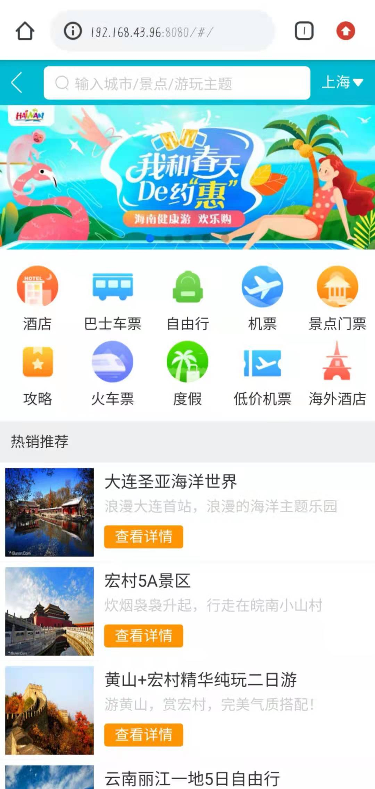
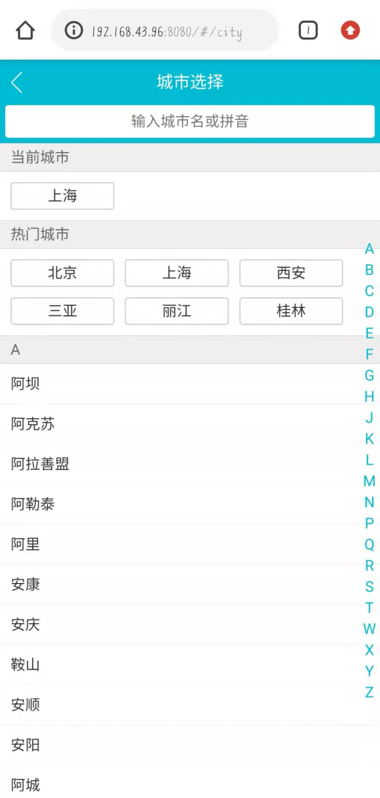
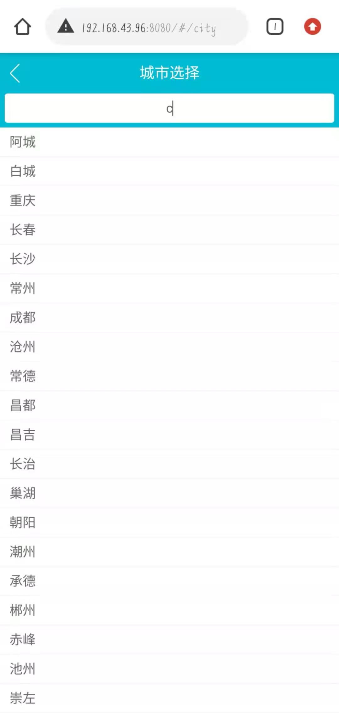
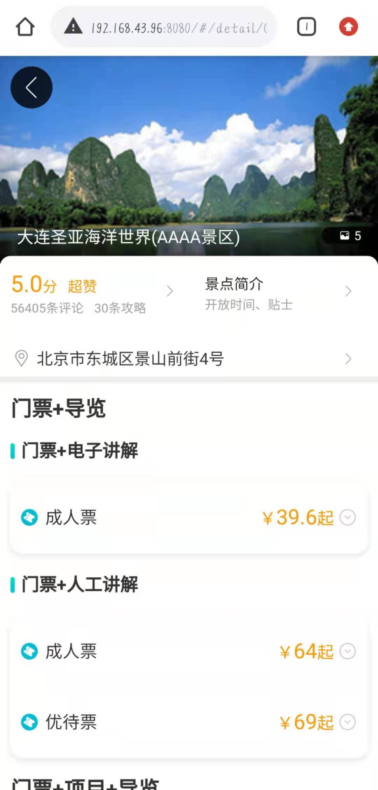
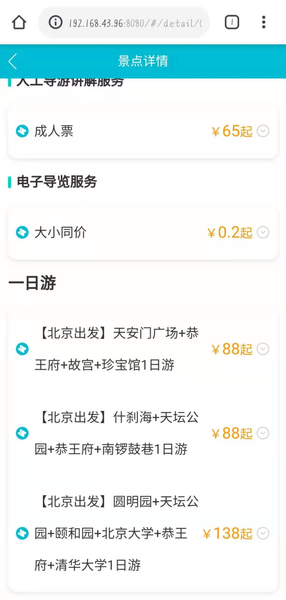

<!--
 * @Author: zi.yang
 * @Date: 2021-03-30 07:28:43
 * @LastEditors: zi.yang
 * @LastEditTime: 2022-10-29 00:37:36
 * @Description: In User Settings Edit
 * @FilePath: /vue-travel/README.md
-->

# vue-travel

仿去哪网旅游网站项目

## 项目介绍

- vue-travel 是慕课网上 Dell 老师的一门 vue 课程，课程参照去哪网展开教学

- vue-travel 使用的是 vue2.x 的语法 , Vue-cli 4.0 的脚手架

_（咳咳！因为不是正规渠道购买，所以 Dell 老师后来补充的 Vue3 升级这里并没有做）_

## 慕课网

_（还是希望各位可以支持正版，Dell 老师的课程一直都很不错，这门课程可以学到很多！）_

课程地址：[Vue2.5-2.6-3.0 开发去哪儿网 App 从零基础入门到实战项目开发](https://coding.imooc.com/class/203.html#Anchor)

课程简介：从 Vue 基础语法入手，逐层递进，实战项目贴近企业流程，完全按照企业级别代码质量和工程开发流程进行授课，让你理解这套技术在企业中被使用的真实流程。更好的掌握 Vue 各个基础知识点。

**注：本项目在课程基础上稍有扩展，课程中组件部分版本被升级，使用方式不同**

## 项目结构

```tree
  │  babel.config.js      // babel配置
  │  vue.config.js        // vue webpack 配置文件
  ├─mock                  // mock 数据
  ├─public                // 静态资源目录
  └─src                   // 代码实现
      │  App.vue          // 入口组件
      │  main.js          // 入口函数
      ├─assets            // 静态资源
      │  ├─iconfont       // 图标库
      │  ├─images         // 图片库
      │  └─styles         // css 样式库
      ├─common            // 通用组件
      ├─components        // 组件库
      ├─pages             // 页面
      ├─router            // 路由
      └─store             // vuex store
```

## Project setup

```
npm install
```

### Compiles and hot-reloads for development

```
npm run serve
```

### Compiles and minifies for production

```
npm run build
```

### Lints and fixes files

```
npm run lint
```

### MOCK Server

mock 数据存放在 `/public/mock/` 下，在开发环境中默认会直接请求。

如果要尝试模拟真实后端请求，请使用 apache / nginx / tomcat 等工具代理，并在部署前端时移除 mock 目录

### Customize configuration

See [Configuration Reference](https://cli.vuejs.org/config/).

## 页面截图







